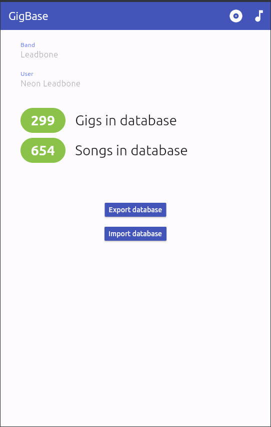
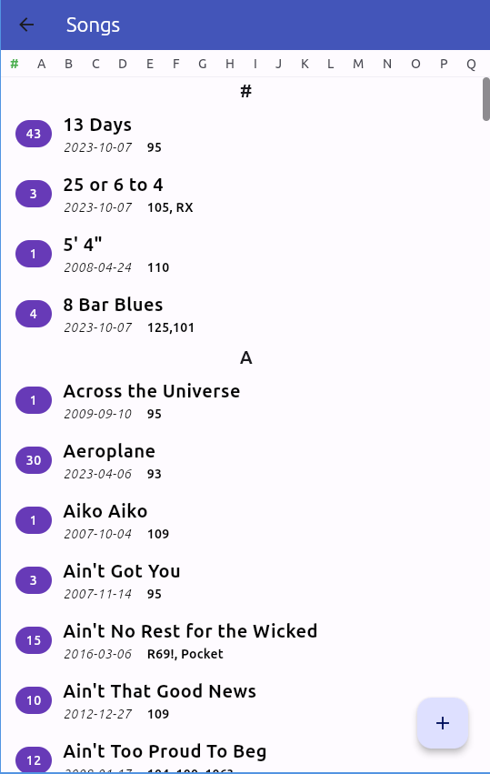
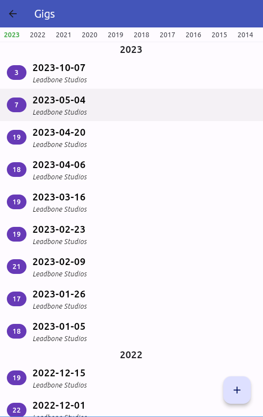
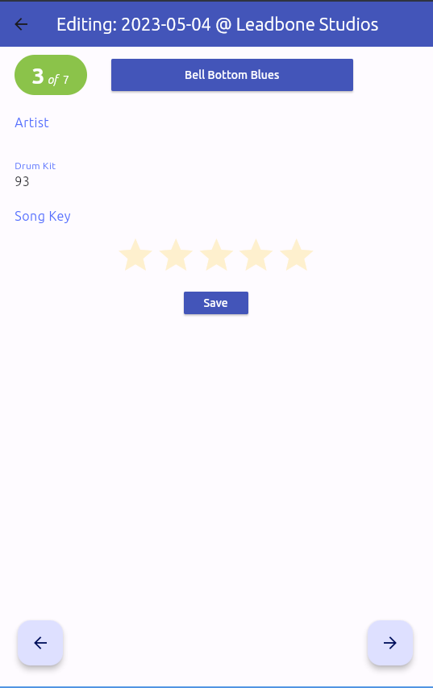

⚠️ This is a work in progress

# GigBase

Flutter app for editing a database of songs and when they were performed. Currently supports
the specific use case of selecting songs and adding them to a gig. There are lots
of other things it should do that haven't been implemented yet.

This is the fourth incarnation of GigBase. The first was a React/GraphQL app using Hasura to
host the database. Performance on Hasura's free tier wasn't great so that lead to a second
incarnation, with a REST backend implemented in PHP. However, the spot where I usually play
didn't have good network connectivity, so that lead to the third incarnation, an Android app
reading from a local SQLite database, written using MIT's App Inventor. That was clunky but 
it worked. There were some problems that I think were due to bugs in the SQLite implementation
for App Inventor, and lots of limitations and minor bugs. 

I used that for several years, then I got a new phone where it wouldn't work, because of changes
to Android's policies regarding writing files. App Inventor is good for getting a quick
version of something running but hard to modify and debug. Hence this version was started, implemented in Flutter. It
looks much nicer, is more solid, and has some features I always wanted, but could never add, in the App Inventor
version (like an indexed scrolling list). Throughout the same database has been
used, starting with PostgreSQL in the original web app then SQLite in the Android apps.

This is probably not useful to anyone but me, except as an example of editing an SQLite database
in Flutter. It does what I need it to do so it's unlikely I'll be adding any new features. Functionality that's missing is covered by being able to edit the
database in a SQLite editor.

## The Database

The core of GigBase is the database, which is currently SQLite 
but started out as PostgreSQL. Note that I've never tested this
app with an empty database. The SQL to create all the tables and
views is included in each `db/*` file, but if there are conflicts 
the SQL in the SQLite file `assets/gigbase.db` is correct.

The most important tables and views are:

### song

A table of song titles and artists. Also includes a *prehistory* column that contains the number of 
times the song was played prior to the creation of the database.

### gig

Table of gig dates and venues, and a boolean indicating whether or not it was recorded.

### performance

Table where each row is a performance of a song at a gig, including the serial number within the gig, 
the drumkit and songkey (arbitrary strings, the drumkit is often a list of several kits), and a *stars* rating.

### most_recent_performance

View listing the most recent performance of a song, the drumkit, songkey, and rating, the gig and the gig's date.
This is what's shown on the Songs page and the Edit Gig pages.

### gigs_reverse

View listing the gigs in reverse chronological order and the number of tracks in each gig. This is what's shown
on the Gigs page.

## The Application

### Main page

Shows the number of gigs and songs in the database along with the band name and stageName of the user. These fields are carried over from when this was
going to be a multiuser app and can't be edited (edit them in the SQLite database).

The *Export* button copies the database to your documents folder as `gigbase.sqlite`. The *Import* button reads a file
with the same name from your documents folder.

The note icon on the top bar takes you to the Songs page, the record icon takes you to the Gigs page.

### Songs page

Lists each song by name, showing the number of performances and the date and drumkit from the most recent performance. The floating button in the lower right corner lets you add a new song. If a song is selected and has 0 performances a button will appear to delete it.

The index at the top can be used to jump quickly to the corresponding letter
in the list.

The song title button from the *Edit gig* page takes you to this list where
you can select a song, or add a new one.

### Gigs page

Lists the gigs in reverse chronological order along with the number of tracks and venue. Selecting a gig will cause a button to appear in the lower right 
corner to open that gig for editing.

### Edit gig page

Shows one performance in a gig, with buttons to navigate to the next or previous. Touch the song title button to select a different song. The
artist field is not editable but the drumkit and songkey fields are, as is 
the rating. When you get to the last performance the button in the lower
right changes to one that lets you add the next performance. Nothing is 
saved until you press the *Save* button.

